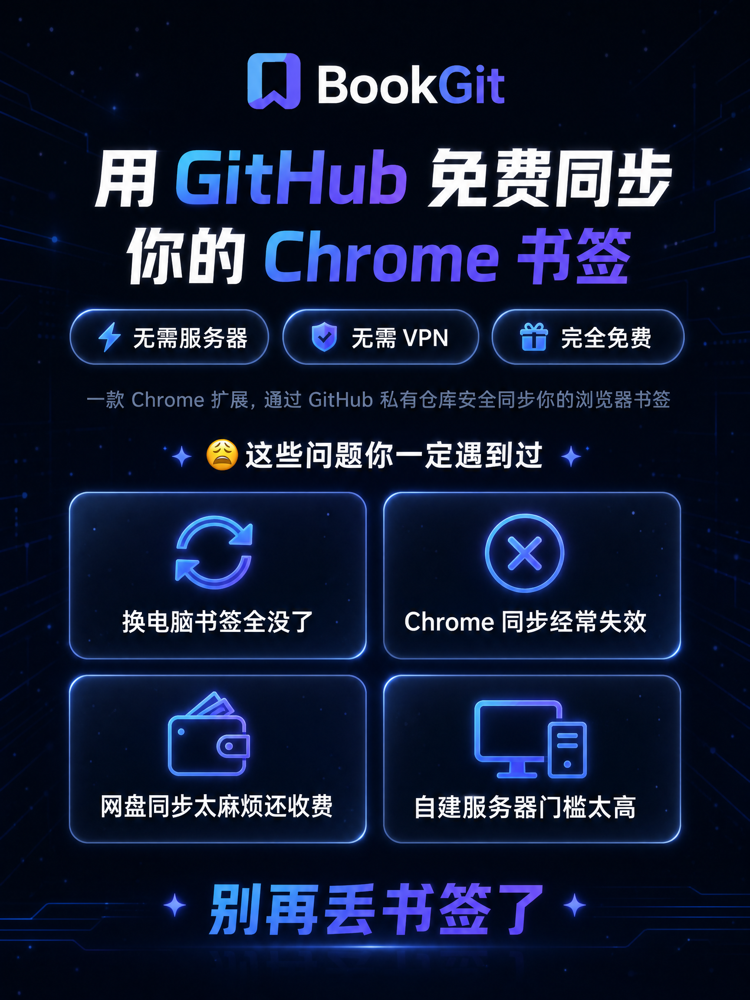
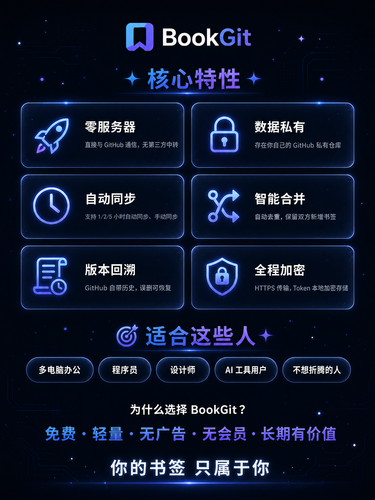
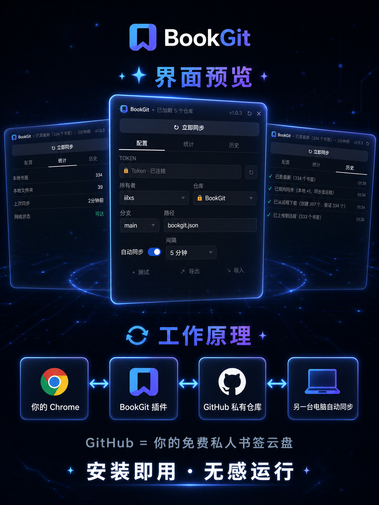

> 🔁 通过 GitHub 仓库同步 Chrome 浏览器书签，无需 VPN，无需服务器

<br>

BookGit 是一个 Chrome 扩展，把你的浏览器书签同步到 GitHub 仓库。家里电脑和公司电脑各装一个，两端书签始终保持一致。全程走 GitHub 公开 API，不需要任何自建服务器。

<p>
  
  
  
</p>

---

## 📑 目录
- [工作原理](工作原理)
- [功能特点](功能特点)
- [前置准备](前置准备)
- [安装](安装)
- [首次配置](首次配置)
- [三种同步方式](三种同步方式)
- [功能介绍](功能介绍)
- [安全说明](安全说明)
- [常见问题](常见问题)
- [支持项目](支持项目)
- [技术栈](技术栈)
- [许可证](许可证)
---

## ⚙️ 工作原理

```
你的 Chrome  ──→  chrome.bookmarks API  ──→  BookGit 插件
                                                │
                                                ▼
                                         GitHub REST API
                                                │
                                                ▼
                                       GitHub 仓库
                                       bookgit.json
                                                │
                                                ▼
                                       另一台电脑的 BookGit
                                                │
                                                ▼
                                       写入 Chrome 书签
```

- 书签以 JSON 格式存储在 GitHub 仓库的 `bookgit.json` 文件中
- 按 URL 去重，同一网址不会重复添加
- 自动同步可设置多种间隔
- 所有网络请求走 `api.github.com`（HTTPS），不需要 VPN

---

## ✨ 功能特点

- **免服务器**: 纯前端插件，数据存在 GitHub，无需任何后端
- **智能合并**: 双向去重合并，不会丢失任何书签
- **Token 安全锁**: Token 连通后永久锁定，不可查看、不可修改
- **定时同步**: 支持多种间隔自动同步
- **多端同步**: 多台电脑安装后自动保持一致
- **网络检测**: 实时检测 GitHub API 可达性

---

## 📋 前置准备

### 1. GitHub 账号

如果没有，前往 [github.com](https://github.com) 注册。

### 2. 创建仓库

1. 登录 GitHub，点右上角 `+` → `New repository`
2. Repository name 填写 `bookgit`（或任意名字）
3. 选择 **Private**（私有仓库，保护书签隐私）
4. 不要勾选任何初始化选项，直接创建

### 3. 生成 Personal Access Token

1. 点右上角头像 → Settings → 左下角 Developer settings → Personal access tokens → Fine-grained tokens
2. 点 `Generate new token`
3. Token name: `BookGit`
4. Repository access: **Only select repositories** → 选择刚创建的仓库
5. Permissions → Repository permissions → **Contents: Read and write**
6. 点 Generate 生成
7. **立即复制 Token**（页面关闭后无法再次查看）

---

## 📥 安装

### 加载插件

1. 打开 Chrome，地址栏输入 `chrome://extensions`
2. 打开右上角 **开发者模式**
3. 点 **加载已解压的扩展程序**
4. 选择 `BookGit` 文件夹
5. 插件出现在列表中，右上角工具栏出现 BookGit 图标

### 刷新插件

每次更新代码后，需要手动刷新：

```
chrome://extensions → 找到 BookGit → 点卡片右下角的 ⟳ 刷新
```

刷新后可在弹窗顶栏确认版本号。

---

## 🛠️ 首次配置

### 第一步：填入 Token

1. 点击工具栏的 BookGit 图标
2. 在 **Token** 输入框中粘贴 GitHub 生成的 Token
   - 经典 Token 以 `ghp_` 开头，细粒度 Token 以 `github_pat_` 开头
   - 输入框为密码类型，显示为圆点
3. 点击输入框右侧的 **🔒** 按钮保存

### 第二步：加载仓库

点击 Token 右侧的 **↻** 按钮，插件会自动：
1. 验证 Token 有效性
2. 获取你的 GitHub 用户名
3. 列出你的所有仓库

### 第三步：选择仓库和分支

- **所有者**：自动填充为你的 GitHub 用户名
- **仓库名称**：下拉选择你创建的仓库（如 `bookgit`）
- **分支**：选择仓库后自动加载分支列表，默认 `main`
- **文件路径**：保持默认 `bookgit.json` 即可

### 第四步：测试连接

点击 **● 测试** 按钮验证配置：

- 成功 → 显示 `✓ 连接成功`，Token 自动永久锁定
- 失败 → 显示具体错误原因

### 第五步：首次同步

点击 **↻ 立即同步**，选择 **🔄 智能合并**。

- 首次使用：本地书签上传到 GitHub
- 多台电脑：各自执行一次后，书签自动合并同步

---

## 🔄 三种同步方式

点击 **↻ 立即同步** 后弹窗选择：

| 方式 | 图标 | 本地书签 | 远程仓库 | 适用场景 |
|------|------|---------|---------|---------|
| **智能合并** | 🔄 | 保留 + 追加远程独有 | 保留 + 追加本地独有 | **日常使用** |
| **上传本地** | ⬆ | 不变 | 被本地覆盖 | 强制用本地数据更新远程 |
| **远程下载** | ⬇ | 被远程覆盖 | 不变 | 新电脑/误删后恢复 |

自动定时同步使用智能合并模式。

---

## 📝 功能介绍

### 配置面板

| 字段 | 说明 |
|------|------|
| **Token** | GitHub 访问令牌，连通后永久锁定 |
| **所有者** | GitHub 用户名 |
| **仓库名称** | 存放书签的 GitHub 仓库 |
| **分支** | 仓库分支 |
| **文件路径** | 书签 JSON 文件路径，默认 `bookgit.json` |

### 定时同步

| 选项 | 说明 |
|------|------|
| **自动同步** | 开启后按间隔自动同步 |
| **间隔** | 1 小时 / 2 小时 / 5 小时 / 仅手动 |

### 同步历史

记录最近 20 次同步操作，每次显示状态、描述和时间。

### 书签统计

| 项目 | 说明 |
|------|------|
| **本地书签** | 当前浏览器中书签总数 |
| **本地文件夹** | 当前浏览器中文件夹总数 |
| **上次同步** | 距离上次同步的时间 |
| **网络状态** | 能否连接 api.github.com |

### 配置管理

| 功能 | 说明 |
|------|------|
| **测试连接** | 验证 Token 和仓库配置是否有效 |
| **导出配置** | 导出仓库/分支/路径配置（不含 Token） |
| **导入配置** | 从剪贴板导入配置 |

### 状态指示

- 工具栏图标上显示徽章：`✓` 成功、`✗` 失败、`!` 冲突
- 弹窗顶栏显示最后同步时间和状态
- 自动同步开关拨动时有即时反馈

---

## 🔒 安全说明

### Token 存储位置

```
插件源文件目录              → ❌ 没有 Token
GitHub 仓库 bookgit.json → ❌ 没有 Token
Chrome 扩展加密存储空间      → ✅ 唯一存放位置
```

- Token 存储在 Chrome 为每个扩展独立分配的加密沙箱中
- 将插件文件夹发给别人安装，里面不含任何 Token
- 导出配置文件不含 Token 字段
- 输入 Token 时显示为密码圆点

### Token 锁定机制

| 阶段 | 界面 | 能否查看 | 能否修改 |
|------|------|---------|---------|
| 未配置 | 输入框可用 | 否（密码点） | 可输入 |
| 已保存·未连通 | 输入框有值 | 否 | 可修改 |
| **连通后** | `🔒 Token · 用户名` | **不可查看** | **不可修改** |

Token 一旦通过测试连接或同步成功验证，立即永久锁定。锁定后：

- 输入框完全消失，只显示一行 `🔒 Token · 用户名`
- 没有显示按钮，没有管理按钮
- 没有任何界面操作可以查看或修改
- 如需更换 Token：`chrome://extensions` → BookGit → **清除存储** → 重新配置

### 书签数据

- 书签内容存储在 GitHub **私有**仓库中
- 同步过程全程 HTTPS 加密传输

---

## ❓ 常见问题

### 两台电脑书签不同，同步后怎样？

智能合并保留两边的书签，按 URL 去重，不会丢失数据。合并后两台电脑内容一致。

### 误删书签能恢复吗？

如果在另一台电脑上同步过，那台电脑的书签仍在远程仓库中。在误删的电脑上选择 **从远程下载** 即可恢复。

两台都误删了的话，可以登录 GitHub，从 `bookgit.json` 文件的提交历史中恢复。

### 换电脑怎么恢复书签？

1. 新电脑安装 BookGit
2. 配置同样的 Token 和仓库
3. 点 **↻ 立即同步** → **从远程下载**
4. 所有书签自动恢复

### 能多人共用书签吗？

可以把仓库添加 Collaborator（Settings → Collaborators），每个使用者用自己的 Token 访问。

### 如何卸载？

```
chrome://extensions → 找到 BookGit → 点击「移除」
```

卸载不影响 GitHub 仓库中的书签数据。

---

## 💖 支持项目

如果 BookGit 为你省下了管理书签的时间，不妨请作者喝杯咖啡 ☕


你的支持是开源项目持续改进的最大动力。

---

## 🧰 技术栈

- Chrome Extension Manifest V3
- Service Worker + Popup
- GitHub REST API v3 (Contents API)
- chrome.bookmarks / chrome.storage / chrome.alarms

---

## 📄 许可证

MIT